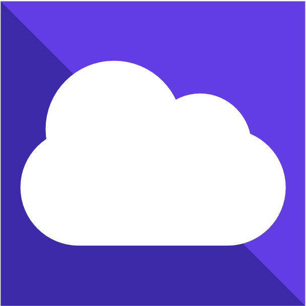
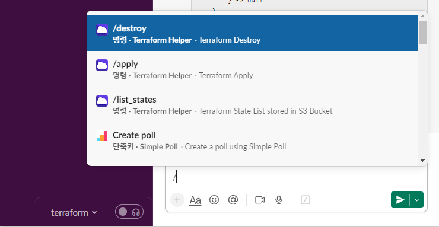

#  Terraform-Slack-App (feat. AWS)



[Terraform](https://www.terraform.io/) Apply/Destroy within Slack using AWS Provider

*Slack에서 [Terraform](https://www.terraform.io/) 명령어를 수행하여 AWS 리소스를 생성/삭제할 수 있는 도구*

<br/>

# Used
- [Slack Bolt for Python](https://github.com/slackapi/bolt-python)
- [AWS CLI](https://aws.amazon.com/ko/cli/)
- [AWS SAMCLI](https://docs.aws.amazon.com/ko_kr/serverless-application-model/latest/developerguide/install-sam-cli.html#install-sam-cli-instructions)
- [Terraform](https://developer.hashicorp.com/terraform/install)

<br/>

# Project Structure
```
📦terraform-slack-app
 ┣ 📂src
 ┃ ┣ 📂listeners
 ┃ ┃ ┣ 📂handlers
 ┃ ┃ ┃ ┣ 📜terraform_apply.py
 ┃ ┃ ┃ ┣ 📜terraform_destroy.py
 ┃ ┃ ┃ ┗ 📜terraform_list_states.py
 ┃ ┃ ┗ 📜commands.py
 ┃ ┣ 📜app.py
 ┃ ┗ 📜requirements.txt
 ┣ 📜.gitignore
 ┣ 📜Dockerfile
 ┣ 📜LICENSE
 ┣ 📜README.md
 ┗ 📜template.yaml
```

<br/>

# Features
#### [🇰🇷 Use Guide](https://hyunsuko.notion.site/Terraform-Slack-App-feat-AWS-f52fb556ea9a4756b3f4586ddbb36890?pvs=4)

- `/list_states`
    - **List Terraform States(main.tf) stored**
      
      ***저장된 Terraform States(main.tf) 목록을 조회하기***
- `/apply [State_Name]`
    - **Create AWS Resources using new Terraform State(main.tf)**
      
      ***신규 Terraform State(main.tf)로 AWS 리소스 생성하기***
        
        `/apply State_Name` 
        
        `[main.tf 내용]`
        
    - **Create AWS Resources using existing Terraform State(main.tf)**
    
      ***기존 Terraform State(main.tf)로 AWS 리소스 생성하기***
        
        `/apply Existing_State_Name`
        
- `/destroy [State_Name]`
    - **Remove AWS Resources using existing Terraform State(main.tf)**
      
      ***Terraform State(main.tf) 바탕으로 생성된 AWS 리소스 삭제하기***

<br/>

# Installation
#### [🇰🇷 Installation Guide](https://hyunsuko.notion.site/Terraform-Slack-App-feat-AWS-f52fb556ea9a4756b3f4586ddbb36890?pvs=4)

- Slack App will be deployed as a Lambda Function.
  
  *Slack App은 Lambda 함수 형태로 배포됩니다.*
- Terraform State will be stored in a S3 Bucket.

  *Terraform State는 S3 버킷에 보관됩니다.*

- Charges may apply based on Lambda/S3 usage in your AWS billing.
  
  *Lambda와 S3 사용량에 따라 AWS 요금이 부과될 수 있습니다.*
